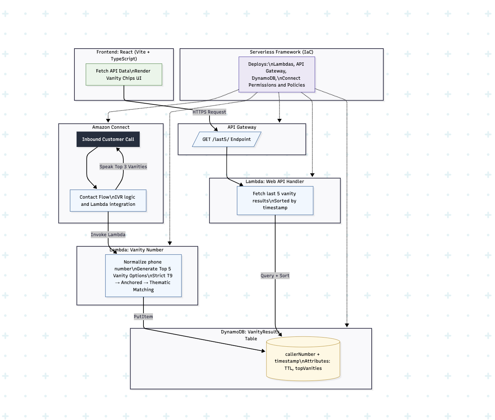

# 1. Reasons for Implementation, Struggles, and Problems Overcome

## Reasons for the design choices

-   **Serverless (Lambda, API Gateway, DynamoDB):** Keeps the footprint
    small, scales automatically, and is cost-efficient.
-   **Dictionary-based word lookup (instead of brute force):** Keeps
    generation feasible and human-readable (e.g., 1-800-FLOWERS rather
    than random sequences).
-   **TypeScript:** Safer development and better tooling for both Lambda
    and React frontend.
-   **Serverless Framework (IaC):** Infrastructure-as-code makes
    deployment reproducible and reviewable.

## Vanity generation logic (current)

-   **Strict T9 first:** I normalize to 10 digits (drop leading `+1`),
    map only 2–9 to letters, and search for Object words of length
    3–12 that exactly match contiguous digit segments. I build
    candidates by overlaying words while preserving digit positions.
-   **Scoring:** Prefer more letters, more vowels, and especially when
    the first letter block starts at index 3 (pattern `XXX-WORD-XXXX`).
    Also add a slight bonus if the last 4 are digits. This keeps results
    memorable and natural.
-   **Always 5 results with real words:** I first return strict T9
    matches, filtered to ensure at least one 3+ letter dictionary word
    is present. If there are fewer than 5 strict results, I used two
    synthesis steps:
    (a) Additional overlays from other valid segments (still strict
        T9) without overlap.
    (b) Anchored related expansion (strict): find other dictionary
        words that map to the exact same digit segment and share
        bigrams/trigrams with the strongest found word; overlay at the
        same position (keeps placement).
    (c) Final theme fallback (relaxed): if still fewer than 5,
        expand with "theme" words that share 2+ letters with the anchor
        word, overlaid at the same position (not strict T9), to reach
        exactly 5. This preserves readability while clearly documented
        as a non-strict step.
-   **Ordering:** Strict T9 candidates always come first (sorted by
    score), then themed fillers, until exactly 5 are returned.
-   **Formatting:** Results are surfaced as `NPA-NXX-XXXX` while
    preserving letter positions (e.g., `469-HOW-5032`).

## Struggles faced & overcome

-   **Combinatorics explosion:** Brute-forcing all possible combinations
    is impractical. Solved by mapping substrings against a dictionary.
-   **Balancing speed vs quality:** Brute-forcing all possible
    combinations is impractical. The generator restricts matches to
    substrings of 3--12 digits and uses heuristic scoring to prioritize
    object words. This avoids Lambda timeouts while still producing
    readable vanity numbers.
-   **Amazon Connect event nuances:** Contact flows pass caller numbers
    in multiple places. I resolved the caller ID from
    `Details.Parameters.callerNumber`, then `CustomerEndpoint.Address`,
    with logging to aid troubleshooting.
-   **Frontend environment differences:** CRA uses process.env, Vite
    requires import.meta.env; fixed by adjusting env handling and adding
    TS typings.
-   **Packaging static data:** The wordlist caused path/bundle issues in
    Lambda. I added an embedded `wordlist.data.ts` export as the primary source to remove runtime
    file dependency.
-   **Quality vs coverage trade-off:** Some numbers only have short
    valid matches. so I added a related-word theme fallback
    to guarantee 5 readable outputs while preserving strict-first
    ordering.

# 2. Shortcuts Taken (Bad Practices in Production)

-   **Bundled wordlist inside the Lambda:** Quick for demo purposes, but
    not scalable. A large dictionary should be stored in S3 or a Lambda
    Layer.
-   **Theme fallback (not strict T9):** The final fallback overlays
    readable "theme" words that do not necessarily map to the same
    digits, to guarantee five options. Useful for UX, but should be
    clearly labeled to users or disabled in strict environments.
-   **DynamoDB scan for recent callers:** Simple for demo, but expensive
    at scale. In production, I will use a GSI or a "recent items" table.
-   **Loose IAM permissions:** I used broad DynamoDB CRUD policy. In
    production, lock this down to least-privilege.
-   **No authentication/authorization:** API is public in demo.
    Production would need Cognito, API keys, or IAM auth.
-   **Minimal tests:** Just a few unit tests to validate logic. A real
    system would require me to add a full integration tests, contract tests, and CI/CD.
-   **Verbose logging in Lambda:** Helpful for debugging, but should be
    reduced or made structured with sampling in production.

These shortcuts let me deliver a working system quickly.

------------------------------------------------------------------------

# 3. What I Would Have Done With More Time

-   **Improve lexical resources:** Add frequency data (common words rank
    higher), fuzzy matching, and multi-word segmentation.
-   **Phonetic and memorability scoring:** Use phoneme similarity and
    pronounceability models (e.g., CMUdict-based heuristics) to prefer
    easy-to-say options.
-   **Efficient indexing:** Build a digit → words index (e.g., trie) and
    package it as a Lambda Layer or use Redis/ElastiCache for super-fast
    lookups.
-   **Schema improvements:** Add a DynamoDB GSI on timestamp for
    efficient queries instead of scans.
-   **CI/CD pipeline:** Automated tests, security scans, linting, and
    deployments (GitHub Actions → staging → prod).
-   **Observability:** Add CloudWatch dashboards, alarms, X-Ray tracing,
    and structured JSON logging.
-   **Frontend polish:** Better UI for search, filtering, pagination,
    and authentication for secure access.
-   **Internationalization:** Support non-US numbering plans and
    alternative keypad mappings.

This would take the project from a "toy demo" into something closer to
production readiness.

------------------------------------------------------------------------

# 4. Other Considerations for Scaling, Security, and Production Hardening

## Scaling

-   Use SQS buffering to absorb spikes in call volume.
-   Add a DynamoDB GSI or a "recent results" table to avoid full scans.
-   Cache results in Redis/ElastiCache for frequently requested numbers.
-   Use provisioned concurrency in Lambda for predictable low latency.

## Security

-   Enforce least-privilege IAM policies.
-   Add API Gateway WAF rules (rate limits, bot protection).
-   Validate and sanitize all inputs (only digits allowed for phone
    numbers).
-   Encrypt data with KMS and rotate any secrets.
-   Consider disclosing when a result includes non-strict theme words to
    avoid misleading users; optionally provide a "strict-only" mode.

## Resilience

-   Enable multi-region DynamoDB global tables for HA.
-   Implement circuit breakers and retries for downstream failures.
-   Set up disaster recovery with backups and cross-region replication.

## Observability

-   Add structured JSON logs, CloudWatch alarms, dashboards, and X-Ray
    traces.
-   Define SLOs (e.g., 99.9% availability, P95 latency under 200ms).
-   Track SLOs with CloudWatch metrics, alarms, and error budgets to
    ensure reliability targets are being met.

------------------------------------------------------------------------

# 5. System Architecture

------------------------------------------------------------------------